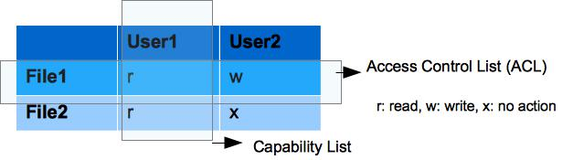
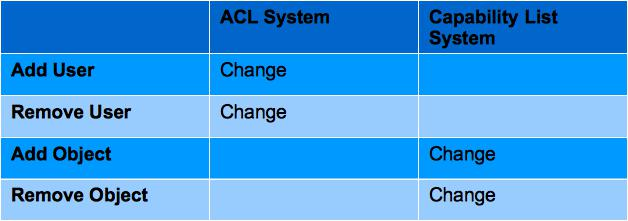
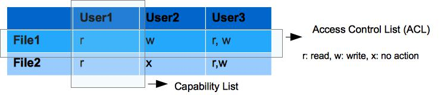
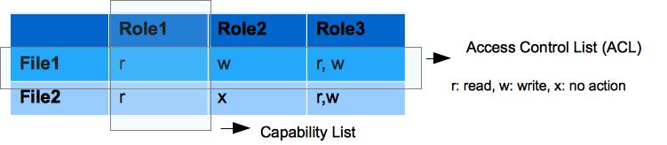

In Access Control List (ACL) each object has a list of (action, user-list) tuple.

table 1: Access Matrix

For example, in the above diagram File1 & File2 would have following ACL:

    File1: ((read, {user1}), (write, {user2}))
    File2: ((read, {user1}), (write, {}))

On the other hand,  in  the capability list system which is a counter-part of ACL system, a user is associated with a list of (action, object-list) tuple.

For example, for user1, capability list would be :

    User1: ((read, {file1,file2}), (write, {}))
    User2: ((read, {}),           (write, {file1}))

While same access matrix can be represented in both ACL and capability list, in this note we will first understand some subtle differences of these two representation and try to  find out **why ACL is better in Object Centric perspective**. In order to evaluate this, we would introduce few  administrative actions that has to be carried out in a access control model.

Worth to mention that ACL and Capability List is just different representations of Raw Access Matrix and **they does not denote new type of Access Control model**, although over time, ACL has been evolved due to its effectiveness in system having large number of object (ex. OpenStack Swift).

- `Add user`: A access control model should be capable to adding new user.
- `Remove user`: A user should have to be removed when needed from the access control system.
- `Add object`: New object or new resource may have to be added.
- `Remove object`: An existing object could be removed from the system.

We are leaving adding and  removing permission from our discussion which is not necessary to compare between ACL and Capability list.

Now, lets see what happens when these actions are  carried out in both ACL and Capability System.

Table 2: Administrative Action (adding/removing of user/object) vs Required Changes in ACL / Capability System

In a ACL system, when a user is being added, it may require that the newly created user gain some privileges on existing objects instantly or later. For example, we assume the worst case such that in a ACL based system, a user is added and it gets read, write action on each existing object. The situation is shown in following figure.

So, the ACL list would be changed as following:

    File1: { (read,[user1, user3]), (write, [user2, user3])}
    File2: { (read,[user1, user3]), (write, [user3])}

So, the point to make here is that in ACL based System, on adding / removing a user, there may be a changed required in the ACL of existing object. On the other hand, similarity, in the capability system, there may be a change required in the Capability list of existing user on addition or removal of an object. The situation is shown in Table2.

Now, from figure 2, we can speculate that if a system has fewer user centric operations (ex. add user, remove user, change in user’s privilege label) and more object centric operation (ex. add object, remove object) ACL is good for it, because in this case ACL required less change than its corresponding Capability list.

An excellent example of it is the reason why OpenStack Object Storage (Swift) uses ACL for maintain its Access Control. Swift is build for storing a large number of objects which require large number of object centric operation and less number of user centric operation.

To make ACL more powerful swift uses ACL with Role instead of ACL with user-identity. That means, while in our given example, we have used user’s identity in the ACL list, Swift uses user’s roles in its ACL. A Role based ACL is shown in following figure. Note that  here Role is used just as a way to group users.

Role based ACL used in Swift.

## Where Capability List is Good fit:
So, we understand where and when ACL is good choice. On the contrary of the previous explanation, is Capability model a good fit in the system where more user centric action is required? The answer is NO. I explain it in terms of enterprise system.

because, Capability model cannot address following issues which are very required in real system:

1. Many users in an organization get same level of privileges because of his /her position in the organization. In Capability Based system it means duplication of same capability list for many users.

2. In enterprise system, a user privilege level may change frequently (ex. user may get promoted). This is hard to manage in capability list.

3. many many others.

The point is that in the Enterprise system, there  are many other user related actions ( ex. delegation, Separation of duty, etc) which cannot be supported by Capability List.

To keep our focus on, we would not talk about User Centric Access Control models (ex. RBAC, DAC etc). Rather, now we would check some of the ACL System.

