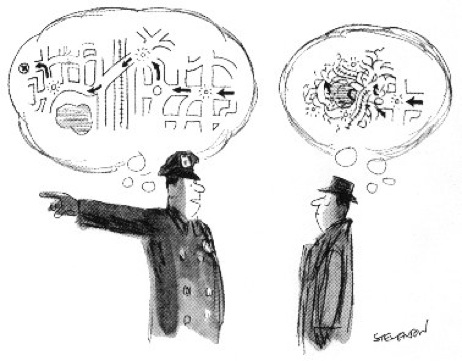
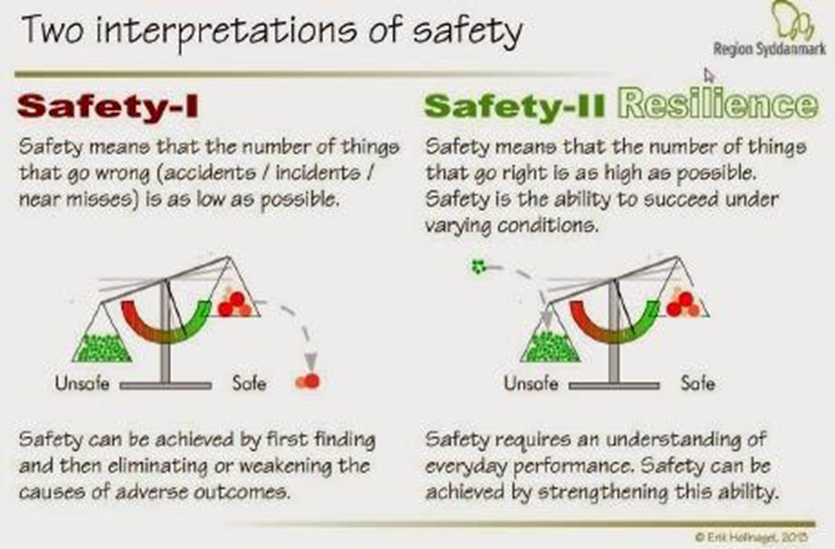
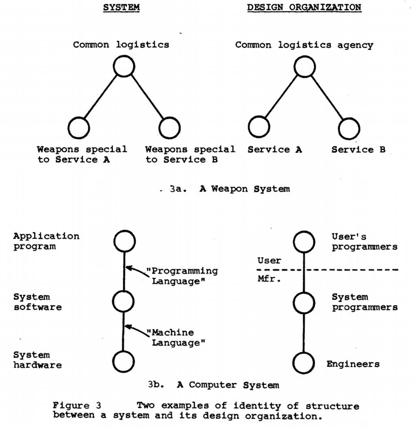

# 康威定律



```text
Any organization that designs a system (defined broadly) will produce a design whose structure is a copy of the organization's communication structure.

——M. Conway
```


通俗说则是： 组织形式直接影响系统设计

## 康威定律四大核心观点

- 第一定律

    ```
    Communication dictates design.
    组织沟通方式决定系统设计。
    ```

    组织的沟通和系统设计之间的紧密联系，在很多别的领域有类似的阐述。对于复杂的系统，聊设计就离不开聊人与人的沟通，解决好人与人的沟通问题，才能有一个好的系统设计。

    《人员神话》给出的沟通成本计算：
    ```
    沟通成本 = n(n-1)/2
    ```
    开发团队应该减少沟通成本造成开发效率的影响。

- 第二定律

    ```
    There is never enough time to do something right, but there is always enough time to do it over.
    时间再多一件事情也不可能做的完美，但总有时间做完一件事情。
    ```
    Eric Hollnagel是敏捷开发社区的泰斗之一，在他《Efficiency-Effectiveness Trade Offs》 一书中解释了类似的论点。
    ```
    Problem too complicated? Ignore details. 
    Not enough resources?Give up features.
    ```
    如何保证飞机飞行系统的稳定性和安全性。Eric认为做到安全有两种方式：
    - 常规的安全指的是尽可能多的发现并消除错误的部分，达到绝对安全，这是理想。
    - 另一种则是弹性安全，即使发生错误，只要及时恢复，也能正常工作，这是现实。

    对于飞机这样的复杂系统，再牛逼的人也无法考虑到漏洞的方方面面，所以Eric建议放弃打造完美系统的想法，而是通过不断的试飞，发现问题，确保问题发生时，系统能自动复原即可，而不追求飞行系统的绝对正确和安全。

    


- 第三定律

    ```
    There is a homomorphism from the linear graph of a system to the linear graph of its design organization.
    线型系统和线型组织架构间有潜在的异质同态特性。
    ```
    

- 第四定律

    ```
    The structures of large systems tend to disintegrate during development, qualitatively more so than with small systems.
    大的系统组织总是比小系统更倾向于分解。
    ```

## 康威定律解释微服务合理性

- 人与人的沟通是非常复杂的，一个人的沟通精力是有限的，所以当问题太复杂需要很多人解决的时候，我们需要做拆分组织来达成对沟通效率的管理

- 组织内人与人的沟通方式决定了他们参与的系统设计，管理者可以通过不同的拆分方式带来不同的团队间沟通方式，从而影响系统设计

- 如果子系统是内聚的，和外部的沟通边界是明确的，能降低沟通成本，对应的设计也会更合理高效

- 复杂的系统需要通过容错弹性的方式持续优化，不要指望一个大而全的设计或架构，好的架构和设计都是慢慢迭代出来的

## 参阅

- [微服务架构的理论基础-康威定律](https://yq.aliyun.com/articles/8611)
- [Conway's Law Homepage](http://www.melconway.com/Home/Home.html)
